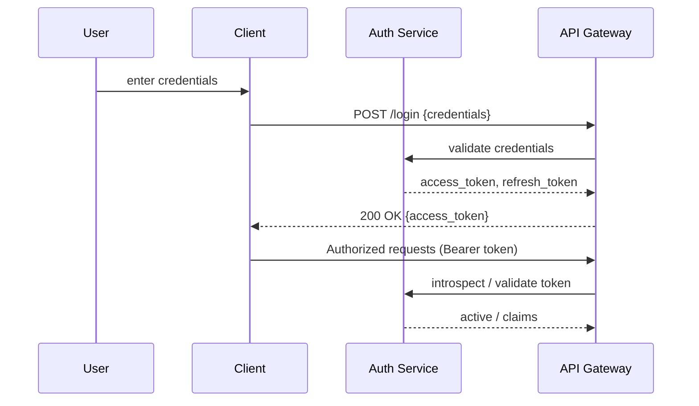

# Authentication flow


```mermaid
sequenceDiagram
  participant U as User
  participant C as Client
  participant A as Auth Service
  participant API as API Gateway

  U->>C: enter credentials
  C->>API: POST /login {credentials}
  API->>A: validate credentials
  A-->>API: access_token, refresh_token
  API-->>C: 200 OK {access_token}
  C->>API: Authorized requests (Bearer token)
  API->>A: introspect / validate token
  A-->>API: active / claims
```
```
