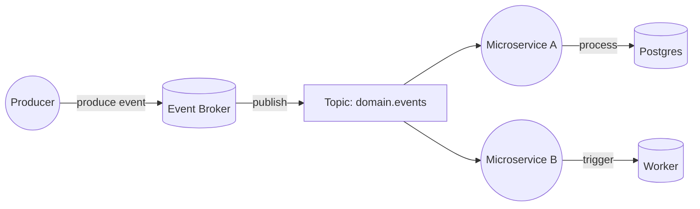

# Event flow


```mermaid
flowchart LR
  Producer((Producer)) -->|produce event| Broker[(Event Broker)]
  Broker -->|publish| TopicA[Topic: domain.events]
  TopicA --> Consumer1((Microservice A))
  TopicA --> Consumer2((Microservice B))
  Consumer1 -->|process| DB[(Postgres)]
  Consumer2 -->|trigger| Worker[(Worker)]
```
```
