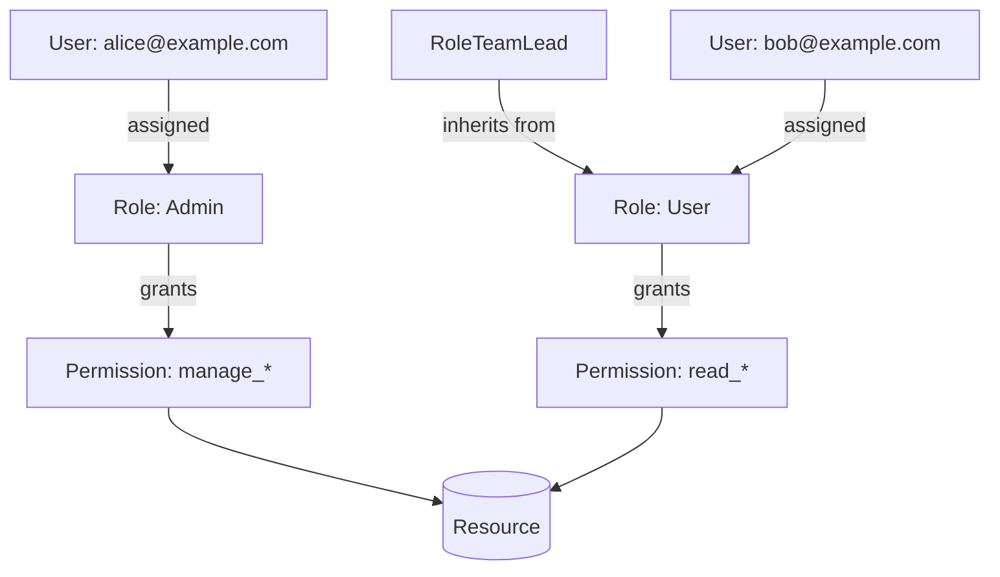

# Permission and role flow


```mermaid
flowchart TD
  RoleAdmin[Role: Admin] -->|grants| PermManage[Permission: manage_*]
  RoleUser[Role: User] -->|grants| PermRead[Permission: read_*]
  RoleTeamLead -->|inherits from| RoleUser
  UserAlice[User: alice@example.com] -->|assigned| RoleAdmin
  UserBob[User: bob@example.com] -->|assigned| RoleUser
  PermManage --> Resource[(Resource)]
  PermRead --> Resource
```
```
