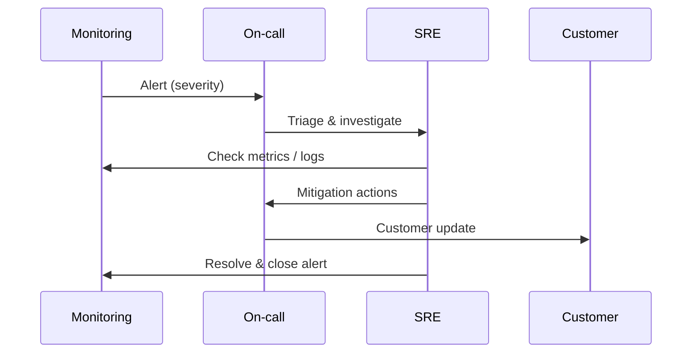

# Production runbook / incident flow


```mermaid
sequenceDiagram
  participant M as Monitoring
  participant O as On-call
  participant S as SRE
  participant C as Customer

  M->>O: Alert (severity)
  O->>S: Triage & investigate
  S->>M: Check metrics / logs
  S->>O: Mitigation actions
  O->>C: Customer update
  S->>M: Resolve & close alert
```
```
