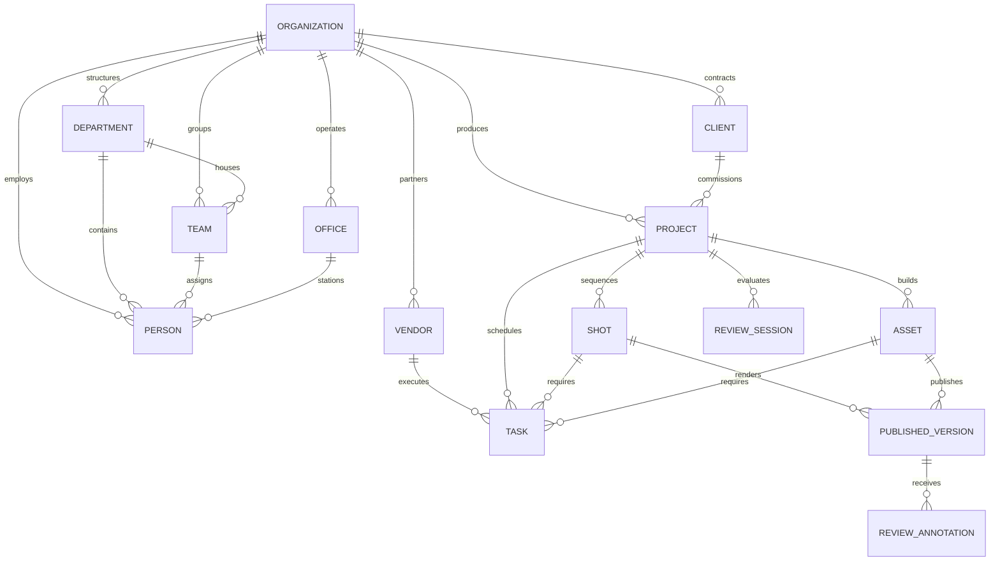

# StudioHub Entity Relationships Specification

## Multi-Tenant Isolation Hierarchy

1. **Organization (Tenant)**:
   - Root isolation boundary.
   - Enforces separate storage quotas, OCIO presets, OpenUSD configurations, and SAML 2.0 / 2FA security enforcement.
   - Every API request carries the `X-Organization-Id` tenant header.

2. **Facilities & Workspaces (Offices, Departments, Teams)**:
   - Partitioning of physical workstations, high-bandwidth SAN connections, software licensing stacks, and artist squads.

3. **Production Sphere (Projects, Shots, Assets, Tasks, Versions, Reviews)**:
   - Non-linear, fully connected production graph.
   - Direct universal cross-referencing via `UniversalEntityType` registry.
